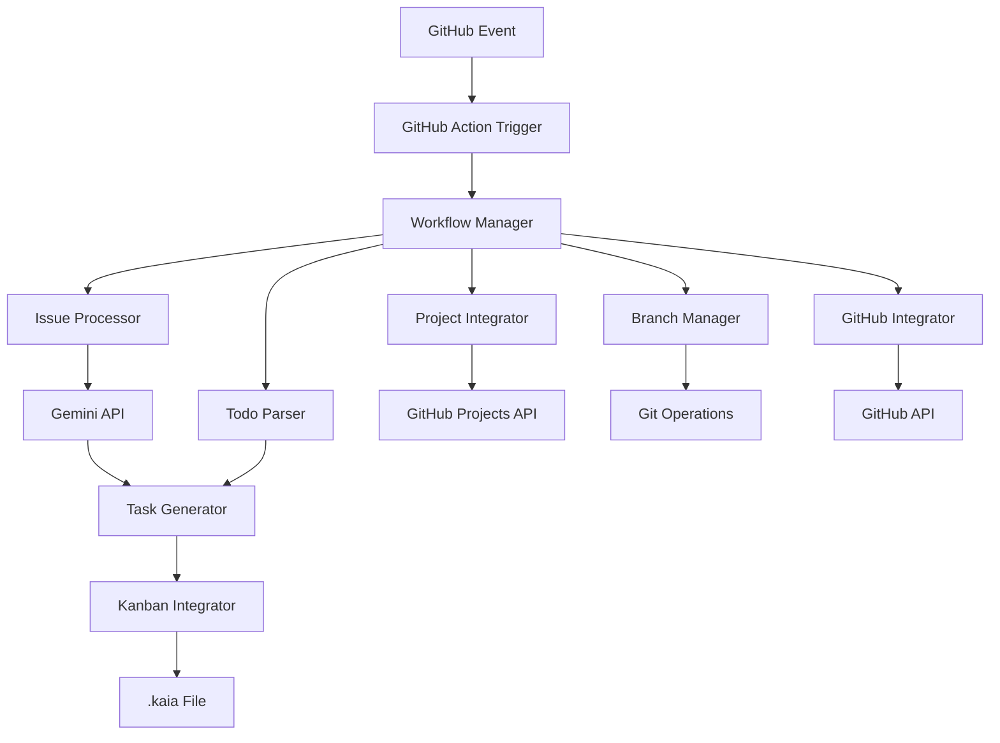

# Design Document: GitHub-Gemini Integration

## Overview

This design document outlines the architecture for a GitHub Action that integrates Google Gemini AI with the existing KanbanGemini CLI tool. The system will automatically process GitHub issues, analyze them using AI, and manage them through the established Kanban workflow while supporting additional features like todo.md parsing, GitHub Projects integration, and automated branch management.

The integration maintains compatibility with the existing kanban.js CLI tool and preserves the French-language conventions and JSON data structure already established in the project.

## Architecture

The system follows a modular architecture with clear separation of concerns:



### Core Components

1. **Workflow Manager**: Orchestrates the entire processing pipeline
2. **Issue Processor**: Handles GitHub issue analysis and extraction
3. **Gemini API Client**: Interfaces with Google's Gemini AI service
4. **Task Generator**: Converts analyzed content into Kanban tasks
5. **Kanban Integrator**: Manages interaction with the existing kanban.js system
6. **Todo Parser**: Processes existing todo.md files
7. **Project Integrator**: Synchronizes with GitHub Projects
8. **Branch Manager**: Handles Git branch creation and management
9. **GitHub Integrator**: Manages GitHub API interactions

## Components and Interfaces

### Workflow Manager

**Purpose**: Central orchestrator that manages the processing pipeline and coordinates between all components.

**Key Methods**:
- `processEvent(eventData)`: Main entry point for GitHub events
- `initializeComponents()`: Sets up all required components with configuration
- `handleError(error, context)`: Centralized error handling with retry logic
- `validateConfiguration()`: Ensures all required environment variables and settings are present

**Dependencies**: All other components

### Issue Processor

**Purpose**: Extracts and preprocesses GitHub issue data for AI analysis.

**Key Methods**:
- `extractIssueData(issue)`: Extracts title, body, labels, and metadata
- `preprocessContent(content)`: Cleans and formats content for AI processing
- `identifyIssueType(issue)`: Determines if issue is bug, feature, question, etc.
- `extractCodeSnippets(content)`: Preserves code formatting during processing

**Data Structures**:
```javascript
{
  id: number,
  title: string,
  body: string,
  labels: string[],
  assignees: string[],
  milestone: string,
  type: 'bug' | 'feature' | 'question' | 'enhancement',
  codeSnippets: string[]
}
```

### Gemini API Client

**Purpose**: Interfaces with Google Gemini AI for content analysis and task generation.

**Key Methods**:
- `analyzeIssue(issueData)`: Sends issue to Gemini for analysis
- `generateAcceptanceCriteria(analysis)`: Creates testable acceptance criteria
- `suggestKanbanColumn(analysis)`: Recommends appropriate column placement
- `detectRelatedIssues(issueData, existingTasks)`: Identifies potential duplicates or related work

**Configuration**:
- API key management through GitHub secrets
- Rate limiting and retry logic
- Response parsing and validation

### Task Generator

**Purpose**: Converts AI analysis results into Kanban task format compatible with existing system.

**Key Methods**:
- `createTaskFromIssue(issueData, analysis)`: Generates complete task object
- `generateUniqueId(existingTasks)`: Maintains sequential ID system
- `formatDescription(content)`: Formats content for kanban.js compatibility
- `mergeWithTodoItems(todoTasks, issueTasks)`: Combines todo.md and issue-based tasks

**Output Format**:
```javascript
{
  id: number,
  titre: string,
  description: string,
  criteres_acceptation: string[],
  source: 'github-issue' | 'todo-md',
  github_issue_id: number,
  branch_name: string
}
```

### Kanban Integrator

**Purpose**: Manages interaction with the existing kanban.js CLI tool and .kaia file format.

**Key Methods**:
- `readKanbanData()`: Reads current .kaia file using existing format
- `writeKanbanData(data)`: Writes updated data maintaining JSON structure
- `addTaskToColumn(task, column)`: Adds task to specified column
- `validateDataIntegrity(data)`: Ensures data structure consistency
- `backupData()`: Creates backup before modifications

**File Operations**:
- Atomic file operations to prevent corruption
- Maintains existing French column names: `idees`, `a_faire`, `en_cours`, `en_revision`, `termine`
- Preserves existing task structure and ID sequencing

### Todo Parser

**Purpose**: Parses existing todo.md files and converts them to Kanban tasks.

**Key Methods**:
- `parseTodoFile(filePath)`: Reads and parses markdown todo format
- `extractTodoItems(content)`: Extracts checkbox items and descriptions
- `mapTodoToKanban(todoItem)`: Converts todo format to Kanban task
- `determineTodoStatus(item)`: Maps checkbox status to Kanban column

**Supported Formats**:
```markdown
- [ ] Uncompleted task (maps to 'a_faire')
- [x] Completed task (maps to 'termine')
- [~] In progress task (maps to 'en_cours')
  - Sub-item description
  - Additional details
```

### Project Integrator

**Purpose**: Synchronizes Kanban tasks with GitHub Projects for enhanced project management.

**Key Methods**:
- `createProjectItem(task, projectId)`: Creates new project item
- `updateProjectStatus(taskId, newStatus)`: Updates project item status
- `mapKanbanToProject(column)`: Maps Kanban columns to project statuses
- `syncCustomFields(task, projectItem)`: Populates project custom fields

**GitHub Projects Mapping**:
- `idees` → "Backlog"
- `a_faire` → "Todo"
- `en_cours` → "In Progress"
- `en_revision` → "In Review"
- `termine` → "Done"

### Branch Manager

**Purpose**: Handles Git branch creation and management for task development.

**Key Methods**:
- `createWorkingBranch(task)`: Creates branch when task moves to 'en_cours'
- `generateBranchName(task)`: Creates standardized branch names
- `commitInitialScaffolding(branch, task)`: Adds template files to new branch
- `createPullRequest(task)`: Creates PR when task is completed

**Branch Naming Convention**:
```
task-{id}-{sanitized-title}
Example: task-42-implement-user-authentication
```

### GitHub Integrator

**Purpose**: Manages all GitHub API interactions including comments, labels, and repository operations.

**Key Methods**:
- `addIssueComment(issueId, comment)`: Adds processing status comments
- `updateIssueLabels(issueId, labels)`: Applies categorization labels
- `commitChanges(files, message)`: Commits .kaia updates to repository
- `createAnnotation(level, message)`: Creates GitHub Action annotations

## Data Models

### Kanban Task Model
```javascript
{
  id: number,                    // Sequential ID (existing system)
  titre: string,                 // Task title (French convention)
  description: string,           // Detailed description
  criteres_acceptation: string[], // Acceptance criteria array
  source: string,                // 'github-issue' | 'todo-md'
  github_issue_id: number,       // Reference to original issue
  branch_name: string,           // Associated working branch
  created_at: string,            // ISO timestamp
  updated_at: string             // ISO timestamp
}
```

### Configuration Model
```javascript
{
  gemini_api_key: string,        // From GitHub secrets
  github_token: string,          // From GitHub secrets
  project_id: string,            // Optional GitHub project ID
  trigger_labels: string[],      // Labels that trigger processing
  column_mapping: object,        // Issue type to column mapping
  branch_prefix: string,         // Branch naming prefix
  debug_mode: boolean            // Enable detailed logging
}
```

### Processing Context Model
```javascript
{
  event_type: string,            // GitHub event type
  repository: object,            // Repository information
  issue: object,                 // Issue data (if applicable)
  configuration: object,         // Action configuration
  existing_tasks: object[],      // Current Kanban tasks
  todo_items: object[]           // Parsed todo.md items
}
```

## Error Handling

### Error Categories

1. **API Errors**: Gemini API failures, GitHub API rate limits
2. **File System Errors**: .kaia file corruption, permission issues
3. **Configuration Errors**: Missing secrets, invalid settings
4. **Data Validation Errors**: Malformed JSON, invalid task data

### Error Handling Strategy

- **Retry Logic**: Exponential backoff for transient failures (max 3 attempts)
- **Graceful Degradation**: Continue processing when non-critical components fail
- **Error Reporting**: GitHub Action annotations and issue comments for visibility
- **Data Protection**: Atomic operations and backups to prevent data loss

### Recovery Mechanisms

```javascript
// Example retry logic
async function withRetry(operation, maxAttempts = 3) {
  for (let attempt = 1; attempt <= maxAttempts; attempt++) {
    try {
      return await operation();
    } catch (error) {
      if (attempt === maxAttempts) throw error;
      await sleep(Math.pow(2, attempt) * 1000); // Exponential backoff
    }
  }
}
```

## Testing Strategy

The testing approach combines unit tests for individual components and property-based tests for system-wide correctness properties.

### Unit Testing Focus
- Component initialization and configuration
- API client error handling and response parsing
- File system operations and data validation
- GitHub API integration points
- Edge cases like empty files, malformed JSON, API failures

### Property-Based Testing Configuration
- **Library**: fast-check for JavaScript property-based testing
- **Iterations**: Minimum 100 iterations per property test
- **Test Environment**: GitHub Actions with Node.js test runner
- **Coverage**: Each correctness property implemented as a single property-based test

### Test Organization
- Unit tests: `tests/unit/` directory with component-specific test files
- Property tests: `tests/properties/` directory with feature-specific property tests
- Integration tests: `tests/integration/` for end-to-end workflow testing
- Test utilities: Shared generators and helpers for consistent test data

## Correctness Properties

*A property is a characteristic or behavior that should hold true across all valid executions of a system—essentially, a formal statement about what the system should do. Properties serve as the bridge between human-readable specifications and machine-verifiable correctness guarantees.*

### Property 1: Issue Processing Completeness
*For any* GitHub issue with configured trigger labels, processing should extract all required fields (title, description, metadata) and preserve code snippet formatting throughout the analysis pipeline.
**Validates: Requirements 1.2, 1.3, 1.5**

### Property 2: AI Analysis Consistency
*For any* processed issue, Gemini API analysis should return structured data including issue classification (bug/feature/question), complexity assessment, column suggestion, and acceptance criteria in the expected format.
**Validates: Requirements 2.1, 2.2, 2.3, 2.4, 2.5**

### Property 3: Task Creation Completeness
*For any* processed issue, the generated Kanban task should contain all required fields (titre, description, criteres_acceptation), be placed in the suggested column, and have a unique sequential ID that follows the existing numbering system.
**Validates: Requirements 3.1, 3.3, 3.4**

### Property 4: Kanban Data Structure Preservation
*For any* valid .kaia file, after adding tasks and writing back to disk, the JSON structure should be preserved with all existing tasks intact and the new tasks properly integrated.
**Validates: Requirements 3.5, 6.1**

### Property 5: Configuration Processing
*For any* set of environment variables and configuration options, the system should correctly load all settings, validate required values, and apply filtering rules for labels, assignees, and milestones.
**Validates: Requirements 4.1, 4.2, 4.4**

### Property 6: Debug Logging Consistency
*For any* processing run with debug mode enabled, the log output should contain more detailed information than normal mode and include all major processing steps.
**Validates: Requirements 4.5**

### Property 7: Retry Logic Behavior
*For any* API operation that fails, the retry mechanism should attempt the operation up to 3 times with exponential backoff delays between attempts.
**Validates: Requirements 5.1**

### Property 8: Success Logging Completeness
*For any* successful processing run, the summary log should contain information about all actions taken including tasks created, files updated, and GitHub operations performed.
**Validates: Requirements 5.3**

### Property 9: Concurrent Processing Safety
*For any* set of issues processed simultaneously, the final .kaia file should contain all tasks without corruption, duplication, or data loss.
**Validates: Requirements 6.2**

### Property 10: ID Uniqueness
*For any* set of generated tasks across all Kanban columns, all task IDs should be unique and follow the sequential numbering pattern.
**Validates: Requirements 6.3**

### Property 11: Atomic File Operations
*For any* file write operation, the .kaia file should either be completely updated or remain in its original state, never in a partially written or corrupted state.
**Validates: Requirements 6.4**

### Property 12: File Format Validation
*For any* .kaia file after processing, the JSON structure should be valid and conform to the expected schema with all required fields present.
**Validates: Requirements 6.5**

### Property 13: Todo.md Parsing Completeness
*For any* valid todo.md file, all markdown checkbox items should be correctly parsed and extracted with their descriptions and status preserved.
**Validates: Requirements 7.1, 7.2**

### Property 14: Todo Status Mapping
*For any* parsed todo item, the checkbox status should correctly map to the appropriate Kanban column (unchecked → a_faire, checked → termine, etc.).
**Validates: Requirements 7.3**

### Property 15: Todo Description Preservation
*For any* todo item with descriptions or sub-items, all information should be preserved in the generated Kanban task description field.
**Validates: Requirements 7.4**

### Property 16: Task Deduplication
*For any* combination of todo.md items and GitHub issues, the merging process should not create duplicate tasks and should handle conflicts appropriately.
**Validates: Requirements 7.5**

### Property 17: GitHub Projects Synchronization
*For any* Kanban task when GitHub Projects is configured, a corresponding project item should be created or updated with the correct status mapping.
**Validates: Requirements 8.1, 8.2**

### Property 18: Project Status Synchronization
*For any* task that moves between Kanban columns, the corresponding GitHub project item status should be updated to match the new column.
**Validates: Requirements 8.3**

### Property 19: Custom Field Population
*For any* GitHub project with available custom fields, task metadata should be appropriately mapped to and populate the relevant custom fields.
**Validates: Requirements 8.4**

### Property 20: GitHub Issue Commenting
*For any* successfully processed issue, a comment should be added to the original GitHub issue containing the generated task ID and relevant processing information.
**Validates: Requirements 9.1**

### Property 21: Issue Labeling
*For any* successfully processed issue, appropriate categorization labels should be applied based on the AI analysis results.
**Validates: Requirements 9.3**

### Property 22: Repository Commit Creation
*For any* Kanban board update, the changes should be committed to the repository with an appropriate commit message.
**Validates: Requirements 9.4**

### Property 23: Related Issue Detection
*For any* set of issues with similar content or keywords, the system should identify and link related issues appropriately.
**Validates: Requirements 9.5**

### Property 24: Branch Creation and Naming
*For any* task moved to the 'en_cours' column, a working branch should be created with a name following the pattern "task-{id}-{sanitized-title}" and the task description should be updated with the branch name.
**Validates: Requirements 10.1, 10.2, 10.3**

### Property 25: Initial Scaffolding Commits
*For any* newly created working branch, initial scaffolding or template files should be committed to provide a starting point for development work.
**Validates: Requirements 10.4**

### Property 26: Pull Request Creation
*For any* task marked as completed, a pull request should be created from the working branch to the main branch with appropriate title and description.
**Validates: Requirements 10.5**